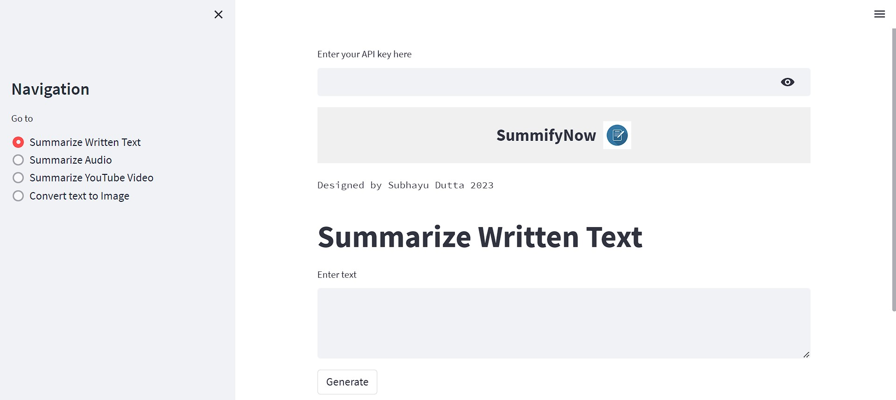

# SummifyNow

SummifyNow is a web application that provides summarization services for various types of content, including text, video, audio, and text-to-image conversion.

## Website

The SummifyNow website is hosted at: (https://summifynow.onrender.com)

## Features

- Text Summaries: Generate concise summaries of written text.
- Video Summaries: Create brief summaries of YouTube videos.
- Audio Summaries: Transcribe and summarize audio files.
- Text-to-Image: Convert text input into an image representation.

## Technologies Used

- Python: The core programming language used for the backend development.
- Streamlit: A web application framework for creating interactive user interfaces.
- OpenAI: APIs used for text summarization and transcription.
- PyTube: A library for downloading YouTube videos.
- MoviePy: A library for video and audio processing.
- EasyOCR: A library for optical character recognition.
- Pillow: A library for image processing.